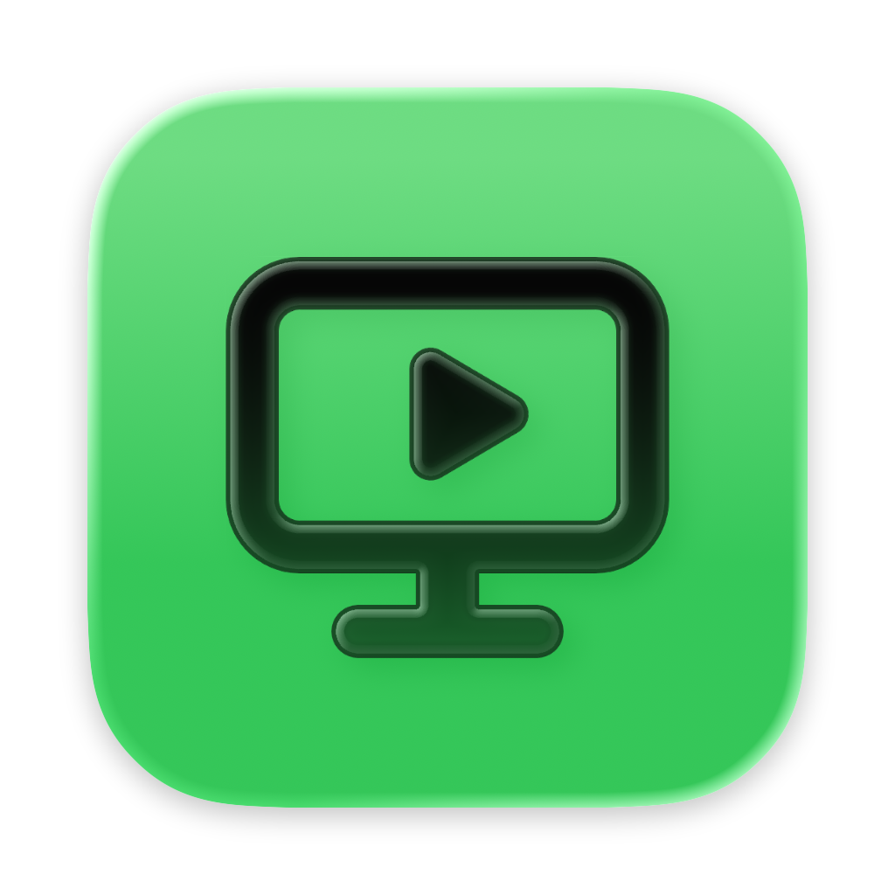
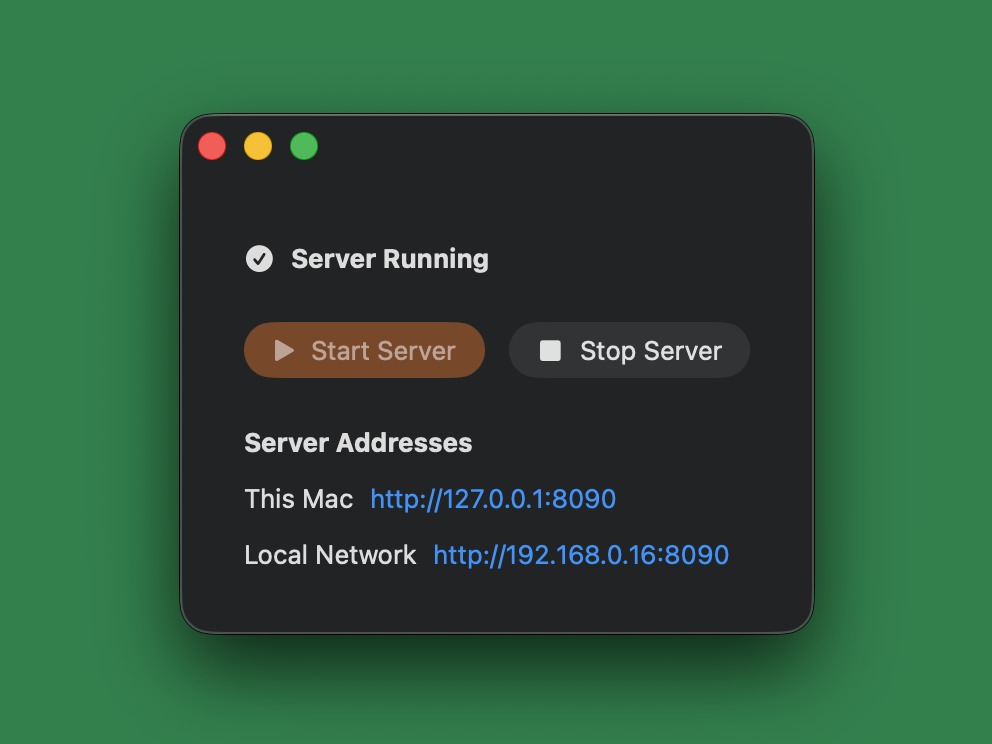

<table>
  <tr>
    <td width="132" valign="middle">
      
    </td>
    <td valign="middle">
      <h1>MacTorrServer</h1>
      <p>A tiny native macOS controller for TorrServer. Start the server, copy a local URL, and use it from your home network.</p>
    </td>
  </tr>
</table>

<p align="center">
  
</p>

## Highlights

- Native SwiftUI app for macOS 26
- One-click start and stop for TorrServer
- Automatically detects private home-network IPv4 addresses
- Adaptive Liquid Glass app icon authored in Apple Icon Composer
- Downloads the official Apple Silicon TorrServer release during installation

## Requirements

- Apple Silicon Mac
- macOS 26 or newer
- Xcode 26 or newer

## Install locally

Download `MacTorrServer-1.0.0.dmg` from the [latest release](https://github.com/maaatheeew/MacTorrServer/releases/latest), open it, and drag **MacTorrServer** to **Applications**.

To build from source instead:

```bash
git clone https://github.com/maaatheeew/MacTorrServer.git
cd MacTorrServer
bash scripts/install-app.sh
```

The script builds `MacTorrServer.app`, compiles the native adaptive icon, downloads the official TorrServer ARM64 binary, and installs the app in `/Applications` when permitted (otherwise in the user's Applications folder).

To create a DMG from the installed app, run `bash scripts/create-dmg.sh`.

## Use

1. Open **MacTorrServer**.
2. Select **Start Server**.
3. Copy the address labelled **Local Network**.
4. Add it to the TorrServer-compatible client or service you use.

The server listens on port `8090`. Keep the app running while you use it; select **Stop Server** to stop the server.

## Adaptive icon

The source icon is [`Resources/AppIcon.icon`](Resources/AppIcon.icon), an Apple Icon Composer document built from the vector [`TV.svg`](Resources/AppIcon.icon/Assets/TV.svg). The install script uses `actool` to compile it into `Assets.car` and a fallback `.icns`, including Default, Dark, and Tinted appearances.

## Privacy and network scope

MacTorrServer runs TorrServer on your local network and does not create an account, send application telemetry, or expose a public internet endpoint. Do not forward port `8090` from your router unless you understand the security consequences.

## Third-party software

MacTorrServer downloads an unmodified TorrServer binary from the official [YouROK/TorrServer](https://github.com/YouROK/TorrServer) releases. TorrServer is licensed under GPL-3.0; see [THIRD_PARTY_NOTICES.md](THIRD_PARTY_NOTICES.md).

## License

MacTorrServer is available under the [MIT License](LICENSE). TorrServer has its own GPL-3.0 license.

[](https://star-history.com/#maaatheeew/MacTorrServer&Date)
